# KakeFlow

[English](#english) · [Tiếng Việt](#tiếng-việt) · [日本語](#日本語)

Local-first household finance for desktop and the browser, built for Japan.

Version 1.2.0 is the current stable desktop milestone.

[Download v1.2.0](https://github.com/thangldw/kakeflow/releases/tag/v1.2.0) · [Product website](https://thangldw.github.io/kakeflow/) · [PWA evidence](docs/assets/demo/kakeflow-receipt-to-provenance.mp4) · [Documentation](docs/README.md) · [Changelog](CHANGELOG.md)

```mermaid
%%{init: {"theme":"base","themeVariables":{"background":"#FFFFFF","fontFamily":"Arial, sans-serif","lineColor":"#667085","primaryTextColor":"#172B4D"}}}%%
flowchart LR
    I["Files, receipts & connectors<br/>Tệp, biên lai / ファイル"]:::yellow
    P["Local parsing & OCR<br/>Parser, OCR / 端末内解析"]:::blue
    E["Encrypted evidence<br/>Bằng chứng / 暗号化証拠"]:::blue
    V["Human review<br/>Duyệt / 人による確認"]:::pink
    L["SQLCipher double-entry ledger<br/>Sổ kép / 複式簿記"]:::purple
    R["Budgets, reports & investments<br/>Kế hoạch / 分析"]:::green
    I --> P --> E --> V --> L --> R
    classDef yellow fill:#FFF4A3,stroke:#C9A227,stroke-width:2px,color:#172B4D
    classDef blue fill:#D9EAFD,stroke:#4C78A8,stroke-width:2px,color:#172B4D
    classDef pink fill:#FFE1E6,stroke:#C96A7B,stroke-width:2px,color:#172B4D
    classDef purple fill:#E9DDF7,stroke:#8064A2,stroke-width:2px,color:#172B4D
    classDef green fill:#DDF5E3,stroke:#4F9D69,stroke-width:2px,color:#172B4D
```



## English

KakeFlow imports user-provided bank, card, wallet, brokerage, spreadsheet, PDF, email and receipt data into an auditable double-entry ledger only after review. It keeps source evidence and row-level lineage, handles card settlement and investment snapshots, and provides Japanese, English and Vietnamese UI catalogs.

Receipt images are processed locally with bundled PP-OCRv5 models. The receipt normalizer accepts wide-spaced yen amounts and tax-marked prices, but it does not invent a transaction date when the source image has none; incomplete results stay outside the ledger for review.

The PWA foundation provides an account-free encrypted browser vault, household and account setup, local receipt OCR, source comparison, explicit approval, balanced double-entry posting, provenance, offline reload, and authenticated encrypted export/restore. IndexedDB stores encrypted events and projections; OPFS stores encrypted evidence where available, with an encrypted IndexedDB fallback. It does not yet provide desktop connectors, multi-device sync, native backup compatibility, or the complete desktop feature set.

Version 1.2.0 checks the signed stable update channel after startup and also exposes a manual check in Settings. Release QA includes synthetic receipt images and the local `/ocr-regression.html` PP-OCRv5 model gate. The [public landing page](https://thangldw.github.io/kakeflow/) presents one synthetic Tanaka-family journey from receipt review through budgets and investments, with separate Japanese, English and Vietnamese animations.

Requirements: Node.js 20.19+ or 22.12+, Rust 1.97 and Tauri 2 platform dependencies.

```bash
npm ci
npm run lint
npm test -- --run
npm run build
npm run build:pwa
npm run test:pwa:e2e
cd src-tauri && cargo fmt --all -- --check && cargo clippy --all-targets -- -D warnings && cargo test
```

KakeFlow does not initiate payments or treat extracted records as confirmed accounting. Ambiguous or unsupported data remains blocked for human review. This repository is the only canonical source and release location; verified downloads are published through [GitHub Releases](https://github.com/thangldw/kakeflow/releases/tag/v1.2.0).

## Tiếng Việt

KakeFlow nhập dữ liệu ngân hàng, thẻ, ví, chứng khoán, bảng tính, PDF, email và hóa đơn do người dùng cung cấp vào sổ kép có thể kiểm toán, nhưng chỉ sau bước duyệt. Hệ thống giữ bằng chứng nguồn và lineage theo từng dòng, hỗ trợ đối soát thẻ, snapshot đầu tư và giao diện Nhật–Anh–Việt.

Ảnh biên lai được xử lý cục bộ bằng model PP-OCRv5 đóng gói. Bộ chuẩn hóa hỗ trợ số tiền yên có khoảng cách và giá có dấu thuế, nhưng không tự tạo ngày giao dịch nếu ảnh nguồn không có ngày; kết quả chưa đủ luôn nằm ngoài sổ cái để chờ duyệt.

PWA foundation có vault trình duyệt mã hóa, không cần account; hỗ trợ tạo household/account, OCR biên lai local, đối chiếu nguồn, duyệt rõ ràng, bút toán kép cân bằng, provenance, reload offline và export/restore mã hóa có xác thực. Event/projection được mã hóa trong IndexedDB; evidence dùng OPFS khi có và fallback sang IndexedDB mã hóa. PWA chưa có connector desktop, đồng bộ đa thiết bị, tương thích backup native hoặc toàn bộ tính năng desktop.

Bản v1.2.0 tự kiểm tra kênh cập nhật ổn định có chữ ký sau khi khởi động và cho phép kiểm tra thủ công trong Cài đặt. QA release có ảnh biên lai tổng hợp cùng trang `/ocr-regression.html` chạy trực tiếp PP-OCRv5. [Landing page chính thức](https://thangldw.github.io/kakeflow/) trình bày một hành trình giả lập của gia đình Tanaka từ duyệt biên lai đến ngân sách và đầu tư, với GIF riêng cho Nhật, Anh và Việt.

Ứng dụng không thực hiện thanh toán và không coi dữ liệu trích xuất là bút toán đã xác nhận. Dữ liệu mơ hồ hoặc chưa hỗ trợ luôn bị khóa để người dùng duyệt. Repo này là nguồn mã và nơi phát hành canonical duy nhất. Dùng các lệnh ở phần English để kiểm thử và build.

## 日本語

KakeFlow は、ユーザーが提供した銀行、カード、ウォレット、証券、表計算、PDF、メール、レシートのデータを、確認後にのみ監査可能な複式簿記台帳へ取り込みます。ソース証拠と行単位の来歴を保持し、カード決済照合、投資スナップショット、日本語・英語・ベトナム語 UI を提供します。

レシート画像は同梱 PP-OCRv5 model で端末内処理します。桁間スペースのある円金額や税率マーカー付き価格を正規化しますが、原本に日付がない場合は取引日を推測せず、不完全な結果を確認前の台帳へ反映しません。

PWA foundation は account 不要の暗号化 browser vault、household／account 設定、端末内 receipt OCR、原本比較、明示的承認、貸借一致の複式記帳、provenance、offline reload、認証付き暗号化 export／restore を提供します。event／projection は IndexedDB、evidence は利用可能な場合 OPFS、fallback は暗号化 IndexedDB に保存します。desktop connector、multi-device sync、native backup 互換、desktop 全機能は未対応です。

v1.2.0 は起動後に署名済み stable update channel を確認し、設定画面からの手動確認にも対応します。release QA には合成レシート画像と、PP-OCRv5 を直接実行する `/ocr-regression.html` を含みます。[公式 landing page](https://thangldw.github.io/kakeflow/) は、田中家の合成シナリオをレシート確認から予算・投資まで、日本語・英語・ベトナム語別 GIF で紹介します。

支払いを開始せず、抽出結果を確定仕訳として扱いません。曖昧または未対応のデータは人による確認までブロックされます。本 repository が唯一の canonical source／release location です。テストとビルドには English セクションのコマンドを使用してください。

Released under the [project license](LICENSE).

Contributions are welcome. Read [CONTRIBUTING.md](CONTRIBUTING.md) before opening an issue or pull request, and use [GitHub Security Advisories](https://github.com/thangldw/kakeflow/security/advisories/new) for private vulnerability reports.
