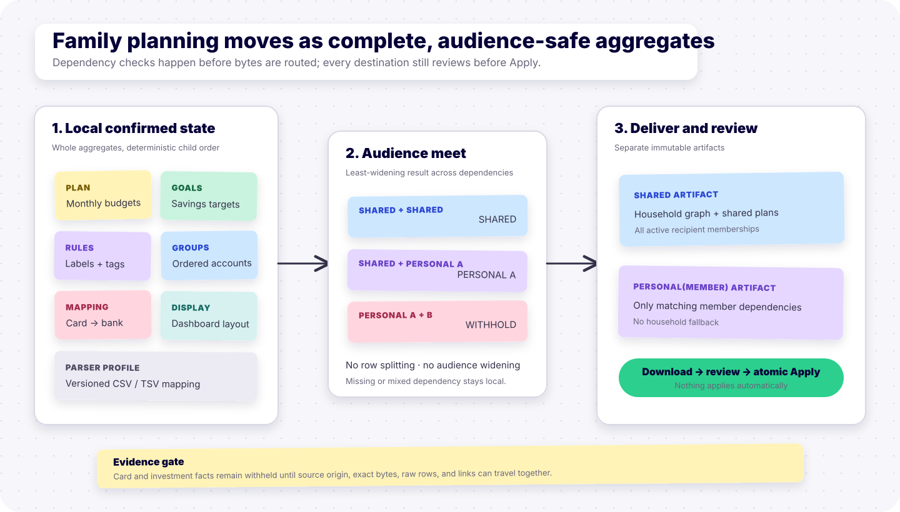
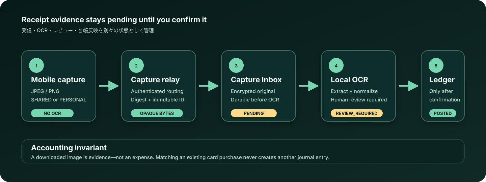
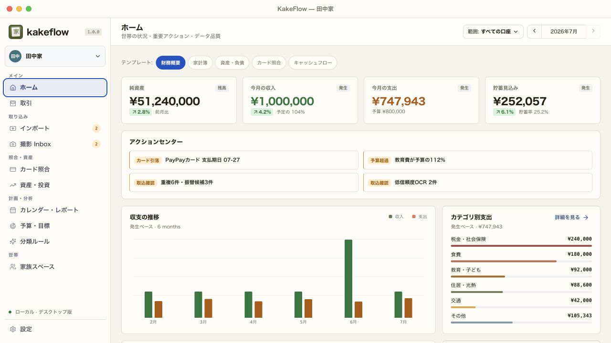
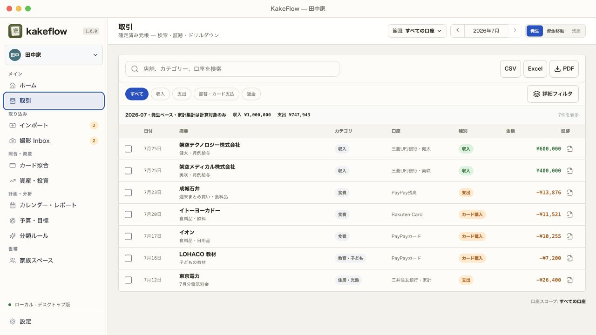
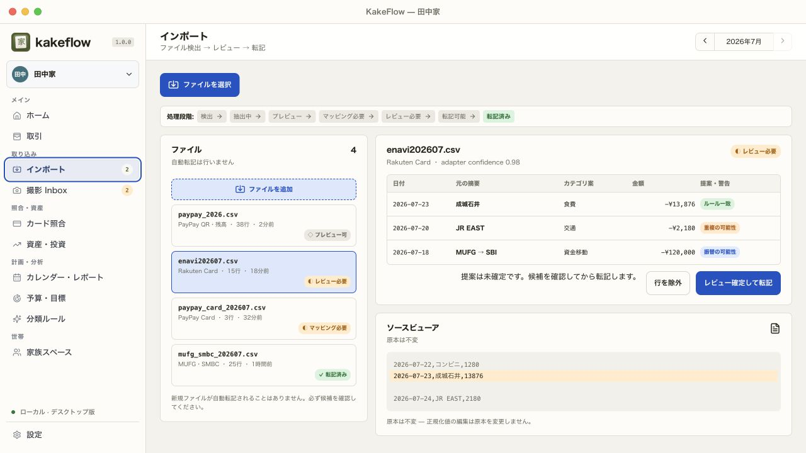
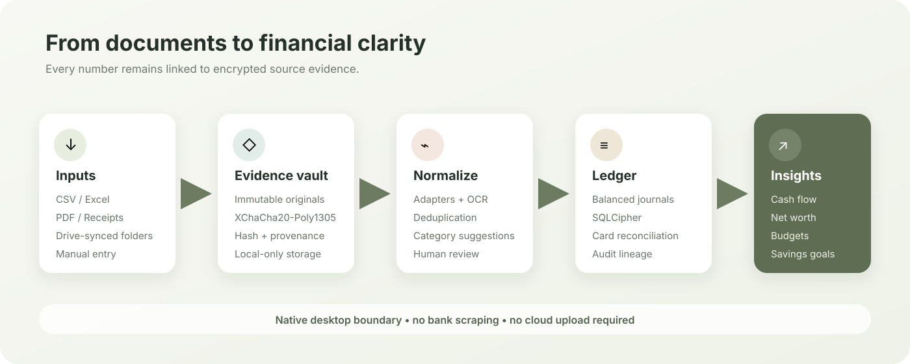
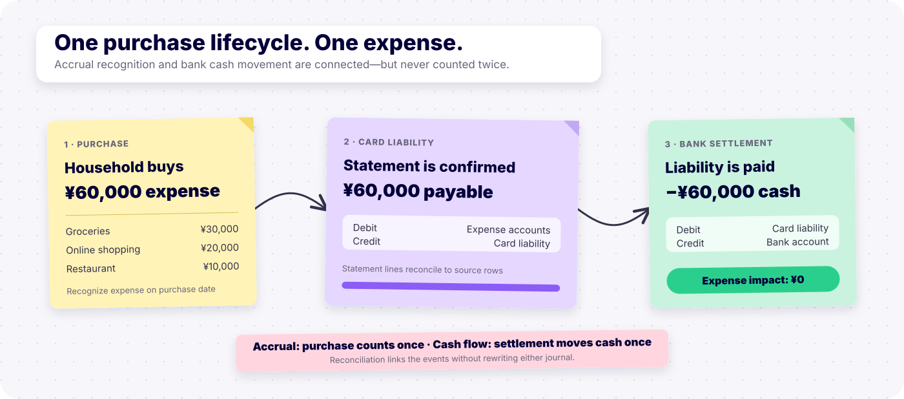
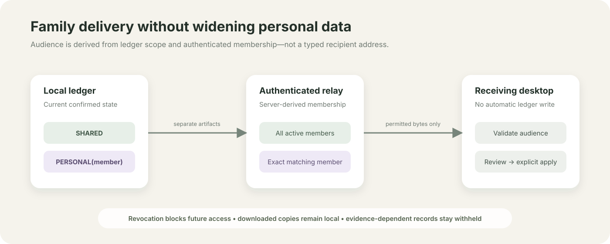

# KakeFlow

KakeFlow is a local-first household finance workspace for macOS and Windows. It turns bank, card, wallet, PDF, spreadsheet, receipt, and securities-asset sources into a reconciled household ledger and a separate investment portfolio.

Project page: [thangldw.github.io/kakeflow](https://thangldw.github.io/kakeflow/) · [Latest stable release](https://github.com/thangldw/kakeflow/releases/latest)

Version 0.90 is the current stable desktop milestone. It adds two strict MUFG
BizSTATION business-account adapters based on official export specifications and
a local [RFC 5322 email attachment path](docs/EMAIL_ATTACHMENT_IMPORT.md) that
retains the complete `.eml` as immutable evidence. Exact account mapping and
review remain mandatory; personal MUFG Direct layouts, direct mailbox OAuth, and
automatic posting are not claimed.

Version 0.73 completes the current source-backed PDF set with [Portfolio Snapshot PDF](docs/PORTFOLIO_SNAPSHOT_PDF.md). It renders the exact securities snapshot selected in the investment workspace—including source `asOf`, JPY summary, asset classes, native-currency positions, snapshot-local FX, nullable values, and Source Document/Row lineage—without falling back to the latest snapshot or inventing performance, live valuation, conversion, trend, ROI/TWR/IRR, or forecast metrics. The [visual QA workflow](docs/PDF_REPORT_VISUAL_QA.md) now requires page-by-page Poppler evidence for all four released PDF report types.

Version 0.72 adds a source-auditable Investment Performance PDF using the same annual period, optional securities-account scope, FIFO engine, native-currency totals, allocations, and exceptions as the screen and [investment workbook](docs/INVESTMENT_PERFORMANCE_XLSX.md). It keeps JPY, USD, and other currencies separate, carries available Source Document/Row lineage, and explicitly avoids invented FX totals, ROI/TWR/IRR, valuation, unrealized, allocation, return, or forecast metrics. The [visual QA workflow](docs/PDF_REPORT_VISUAL_QA.md) now requires page-by-page Poppler evidence for monthly, annual, and investment-performance PDFs before release.

Version 0.71 added a source-backed Annual Household Review PDF using the exact validated year, account-group, member-attribution, and as-of scope shared by the screen and annual CSV/XLSX exports. Its Executive Summary combines comparable-period KPIs with a status-aware 12-month trend, then retains drivers, budget, goals, import health, card reconciliation, actions, and accounting caveats.

Version 0.70 added the source-backed Monthly Household Review PDF using the same validated scope and DTO as the on-screen review and [monthly workbook](docs/MONTHLY_REVIEW_XLSX.md). The native four-page report embeds pinned Noto Sans JP, opens with an Executive Summary, KPI cards and exact-value comparison bars, and preserves budget, goals, import-health, card-reconciliation, action, and double-counting disclosures.

Version 0.69 adds [Portfolio Snapshot XLSX export](docs/PORTFOLIO_SNAPSHOT_XLSX.md). The native workbook exports the exact securities snapshot selected in the investment workspace, including its JPY summary, asset classes, positions, snapshot-local FX rates, nullable values, and source-row lineage. It never silently replaces the selection with the latest snapshot and does not mix event-based FIFO performance, live valuation, Money Forward aggregate history, or multi-snapshot trends into the snapshot grain.

Version 0.68 adds [Investment Performance XLSX export](docs/INVESTMENT_PERFORMANCE_XLSX.md). The native workbook reuses the exact annual FIFO performance request shown in the investment workspace, keeps every source currency separate, and exposes realized allocations, corporate actions, uncovered sales, skipped events, and source-row evidence where the validated report provides it. It intentionally excludes current holdings valuation, FX conversion, portfolio snapshots, aggregate asset history, and invented ROI/TWR/IRR metrics.

Version 0.67 adds [Monthly Household Review XLSX export](docs/MONTHLY_REVIEW_XLSX.md). The native four-sheet workbook preserves the selected calendar month, account group, and household/member attribution scope while clearly keeping goals and data quality household-wide. It includes current KPIs, prior-month and prior-year comparisons, bounded category and merchant drivers, budget, reconciliation, and import-health disclosures; `asOf` remains a data-quality reference date and workbook bytes never cross WebView IPC.

Version 0.66 adds a strict [PayPay Card finalized-statement import](docs/PAYPAY_CARD_IMPORT.md). PayPay Card officially supports per-billing-month CSV downloads only after finalization, but does not publish a literal consumer schema; KakeFlow therefore implements one exact ordered eleven-column community-derived synthetic contract. Only safe-integer JPY one-time rows with zero fees, carry-forward, and adjustments, equal usage/total/current billed amounts, and one consistent source payment date are accepted. Deferred, ambiguous, malformed, or unfamiliar layouts fail closed and every file requires explicit credit-card liability mapping and review.

Version 0.65 adds [Annual Household Review XLSX export](docs/ANNUAL_REVIEW_XLSX.md). The native workbook reuses the exact validated report, selected account group/member scope, year, and as-of date shown in KakeFlow. Its Summary, Monthly, Drivers, and Health sheets retain complete/partial/future month states, typed financial values, Japanese labels, reconciliation, and data-quality disclosures; workbook bytes never cross the WebView IPC boundary.

Version 0.64 adds restart-safe [receipt item review and split posting](docs/RECEIPT_ITEM_SPLIT.md). Import Inbox exposes a bounded projection of item, tax, coupon, point, payment, confidence, and source-line evidence before approval. An exact outgoing receipt can create one categorized expense debit per item while preserving the original payment credit; mismatched totals disclose their delta and require explicit manual allocation instead of guessing how tax, discounts, or points should be treated.

Version 0.63 adds a strict [AEON finalized-statement import](docs/AEON_CARD_IMPORT.md). Detection uses an AEON content marker, named finalized fields, dated detail rows, and one exact statement total rather than a filename. Refunds retain their negative sign, while installment, revolving, bonus, partial, ambiguous, multi-section, malformed, and unfamiliar layouts fail closed. The checked-in fixture is screen-derived synthetic because AEON does not publish a literal consumer CSV schema.

Version 0.62 adds bounded [scanned and hybrid PDF OCR](docs/SCANNED_PDF_OCR.md). The complete PDF remains immutable evidence, page outcomes and OCR boxes stay aligned with the source viewer, and only pages that independently parse as receipts create review-required candidates. Statement and blank pages never become expenses; a source-only import preserves a multi-page document when no page is eligible. The macOS bundle stages a pinned static Tesseract 5.5.2 runtime with Japanese and English models and verifies it without relying on the host `PATH`.

Version 0.61 adds a dedicated [Monex U.S.-stock Trade History import](docs/MONEX_US_STOCK_IMPORT.md). It recognizes the complete screen-derived 16-field family without relying on a filename, supports explicit post-renewal U.S.-dollar spot buys and sells, preserves exported gross/settlement/fee values and physical-row evidence, and requires the user to choose an existing securities account. Yen settlement and non-spot activity remain blocking because the public documentation does not establish safe dual-currency or event-specific settlement semantics; the included fixture is explicitly synthetic rather than claimed as a Monex-issued sample.

Version 0.60 makes encrypted family delivery recover correctly when relay membership keys change. KakeFlow first replays the exact persisted `KFE1` bytes, resets an envelope only after the relay returns the exact pre-storage `RECIPIENT_SET_CHANGED` rejection, and then reseals on the next explicit Send. Ambiguous failures retain their immutable retry bytes, mixed upload outcomes are reconciled independently, and interrupted sends recover after restart without automatic delivery or Apply. See [recipient-set recovery](docs/FAMILY_RECIPIENT_SET_RECOVERY.md).

Version 0.59 adds opt-in [background family-delivery discovery](docs/BACKGROUND_FAMILY_DISCOVERY.md). While KakeFlow is open, the native desktop process can periodically authenticate the saved relay connection, refresh membership/public-key state, and register new publication metadata as `AVAILABLE`. It never sends, downloads, decrypts, stages, reviews, or applies an artifact automatically; those actions remain explicit. The relay token is stored in the operating-system credential store only after opt-in and is removed when automatic checks are disabled or the connection is disconnected.

Version 0.58 wraps unchanged family artifacts in the recipient-encrypted `KFE1` transport envelope. Each active destination membership receives its own X25519-wrapped payload key, the relay stores opaque XChaCha20-Poly1305 ciphertext, and exact encrypted bytes are retained for idempotent retry. Device private keys remain in native OS credential storage; inbound artifacts are decrypted natively and still require explicit review and Apply. This is relay-blind recipient encryption, not a sender-signature or automatic-sync claim.

Version 0.57 adds [audience-partitioned card and investment evidence delivery](docs/FAMILY_EVIDENCE_DELIVERY.md). Family schema v3 carries seven new card and investment aggregates inside a digest-bound `KFF3` envelope with their original document bytes and raw rows. Source IDs are qualified by the installation that created them, private evidence never widens into a shared partition, and staging remains non-mutating until one explicit atomic Apply.

Version 0.56 adds [audience-partitioned planning and configuration delivery](docs/FAMILY_PLANNING_CONFIG_DELIVERY.md). Family schema v2 carries complete monthly-budget, savings-goal, classification-rule, account-group, settlement-mapping, dashboard-layout, and parser-profile aggregates through the same explicit review/atomic-apply boundary as the core family graph. Least-widening account dependencies select `SHARED` or matching `PERSONAL(member)` delivery; mixed, other-member, unresolved, ownerless personal account groups, and evidence-dependent facts remain visibly withheld.



Version 0.55 adds a dedicated [mobile receipt-capture protocol and desktop Capture Inbox](docs/MOBILE_RECEIPT_CAPTURE.md). A reference mobile-browser uploader sends one immutable JPEG/PNG capsule through a separate authenticated relay channel; the desktop stores and previews the original before local OCR, then creates only a normal `REVIEW_REQUIRED` receipt candidate. Receiving, OCR, matching, and promotion never post a transaction automatically.



Version 0.52 adds a strict, dedicated [Rakuten Securities domestic trade-history import](docs/RAKUTEN_SECURITIES_IMPORT.md) for explicit spot and odd-lot stock purchases and sales. It preserves source settlement semantics and physical-row evidence, requires an explicit securities-account mapping, and rejects credit/margin, `現引`/`現渡`, and other unsupported rows instead of guessing their investment treatment.

Version 0.51 adds a strict, dedicated [SBI Securities trade-history import](docs/SBI_SECURITIES_IMPORT.md) for supported domestic and foreign spot stock purchases and sales. It preserves the official export fields and physical-row evidence, requires an explicit securities-account mapping, and rejects margin and other unsupported transaction types instead of guessing their accounting treatment.

Version 0.50 carries the independent Home widget layouts for Financial Overview, Household Ledger, Assets & Liabilities, Card Reconciliation, and Cash Flow inside schema-v4 local change packages. Moving a household between desktops now preserves each view's order and visibility without weakening schema-v1 through schema-v3 compatibility. See [dashboard preferences](docs/DASHBOARD_PREFERENCES.md).

Version 0.47 made pending import review restart-safe. Import Inbox discovers every household-scoped manual or folder import still in `REVIEW_REQUIRED`, restores its existing immutable preview, deduplicates the two discovery paths, and still requires explicit approval before posting. See [pending import recovery](docs/PENDING_IMPORT_RECOVERY.md).

Version 0.46 added a household-persisted Home layout editor. Users can reorder eligible widgets by drag-and-drop or accessible move buttons, hide and restore panels, and reset the active template while KakeFlow preserves accounting basis, metric definitions, drill-downs, and the rule that at least one widget remains visible. See [dashboard preferences](docs/DASHBOARD_PREFERENCES.md).

Version 0.45 extended the [Money Forward ME household-ledger import](docs/MONEY_FORWARD_HOUSEHOLD_IMPORT.md) to full exports containing multiple `保有金融機関` values. Import Inbox renders one explicit Asset/Liability account mapping per normalized institution and keeps staging disabled until every mapping is complete. Candidate rows retain their own source institution, transfer/calculation-target semantics, categories, memo, stable external ID, and immutable evidence; KakeFlow never guesses or auto-creates the destination accounts.

## Product tour

The household overview combines net worth, monthly income and spending, trends,
category composition, recent transactions, and card-settlement status.



| Searchable transaction ledger | Import and review inbox |
| --- | --- |
|  |  |

## How KakeFlow works



KakeFlow deliberately separates expense recognition from cash settlement. A
credit-card purchase creates an expense and a card liability; the later bank
debit settles that liability without counting the expense twice.



## Run locally

Use Node.js 20 LTS or 22 LTS.

```bash
npm install
npm run dev
```

Production checks:

```bash
npm run lint
npm run build
npm test
cd src-tauri && cargo clippy --all-targets -- -D warnings && cargo test
```

Desktop development also requires Rust 1.97. The desktop app creates a random database master key on first launch and stores it in macOS Keychain or Windows Credential Manager:

```bash
npm run desktop:dev
```

Build an unsigned local macOS/Windows artifact:

```bash
npm run desktop:build
```

Run the same non-destructive release-readiness smoke sequence as CI (version check,
frontend tests/lint/build, Rust format/Clippy/tests, and an unsigned
`tauri build --no-bundle`):

```bash
npm run desktop:smoke
```

The smoke command compiles and verifies the native executable but never launches
the app, opens a user database, creates an installer, or accesses signing keys.
GitHub Actions runs it independently on macOS and Windows. Signing, Apple
notarization, and production update credentials remain external release steps.

When GitHub-hosted runners are unavailable, follow the checked [manual GitHub
release procedure](docs/MANUAL_GITHUB_RELEASE.md): run every local desktop gate,
create the verified tag, and upload the locally built artifact with `gh release
create`. The release workflow is dispatch-only so pushing a tag does not create a
known-failing quota job.

## Product principles

- Source files are immutable evidence, not transactions by themselves.
- Source rows, business events, and ledger entries are separate concepts.
- Card purchases count as expenses; the later bank debit is a liability payment and must not double-count spending.
- Dashboard metrics read confirmed ledger data, not raw extraction candidates.
- Every displayed number should remain traceable to its original source.

## Intended architecture

```text
Local/synced folder
  -> source document store
  -> adapter detection and extraction
  -> normalized candidates
  -> deduplication and reconciliation
  -> user review
  -> double-entry ledger
  -> analytics views
  -> desktop dashboard
```

The React application is the presentation and import-preview layer. Tauri/Rust owns the encrypted database, migrations, OS paths, and IPC boundary:

```text
src/               React UI, import adapters, review workflow, typed IPC client
src-tauri/         Tauri shell, SQLCipher ledger, encrypted vault, PDF/OCR, backup/restore
```

KakeFlow never stores the database key in its database, logs, application bundle, or process environment. A portable v2 backup encrypts the ledger, source-document vault, and a cross-device key capsule with a user passphrase. Backup destinations are selected by the native backend; restore is authenticated, staged, semantically validated, confirmed in a native OS dialog, and activated through a restart-safe journal.

Receipt and scanned-PDF OCR are offline. Development builds use `tesseract` from `PATH` and require the `jpn` and `eng` language models. Release bundles may instead provide `ocr/tesseract` (or `tesseract.exe`), both models, and `tessdata/configs/tsv` in the Tauri resource directory; if neither source is complete, the app reports OCR as unavailable and does not upload the document anywhere.

## Data and release safety

- SQLCipher encrypts the canonical ledger; XChaCha20-Poly1305 encrypts immutable source documents.
- macOS Keychain or Windows Credential Manager stores the active master key.
- Backup archives and restore work have aggregate byte, entry, and record budgets.
- Imported candidates remain reviewable and rollbackable until they are posted atomically as balanced journal entries.
- The checked-in desktop workflow produces **unsigned/ad-hoc** macOS and Windows artifacts. Public distribution still requires Apple Developer ID signing/notarization and a Windows code-signing certificate.

## Current capabilities

- Local [RFC 5322 email attachment import](docs/EMAIL_ATTACHMENT_IMPORT.md) that
  stores the exact `.eml` as immutable evidence and qualifies rows from its one
  selected CSV/TSV/XLSX attachment with `sourcePart`. Multiple importable
  attachments, unsupported schemas, and ambiguous selection fail closed. The
  durable Folder Inbox can discover locally saved `.eml` files from a selected
  mail-drop folder, but this is not mailbox OAuth, mailbox API access, or remote
  background email polling.
- Dedicated [MUFG BizSTATION all-details import](docs/MUFG_BIZSTATION_IMPORT.md)
  for the official Shift_JIS business-account record family, with exact
  header/detail/footer/final validation, totals and running-balance
  reconciliation in either source order, immutable row provenance, explicit
  bank-account mapping, and no automatic posting. This does not claim support
  for personal MUFG Direct exports.
- Dedicated [MUFG BizSTATION deposit/withdrawal import](docs/MUFG_BIZSTATION_DEPOSIT_WITHDRAWAL_IMPORT.md)
  for the official twenty-field business-account export, with fixed code,
  padded amount, single-source-account, and bounded Japanese-calendar
  validation. The source has no balance or durable transaction ID, and
  era-ambiguous archival dates fail closed instead of being guessed.
- Opt-in [background family-delivery discovery](docs/BACKGROUND_FAMILY_DISCOVERY.md) at a persisted 15, 30, or 60 minute interval while the desktop process is open. The native worker refreshes the authenticated household/membership and local public-key registration, records only inbound publication metadata as `AVAILABLE`, uses bounded leases and retry backoff, and suspends for explicit reauthorization after terminal credential or membership failures. Sending, artifact download, `KFE1` decryption, review, and atomic Apply remain manual.
- Dedicated [mobile receipt-capture capsules and desktop Capture Inbox](docs/MOBILE_RECEIPT_CAPTURE.md) with a separate authenticated relay cursor, immutable JPEG/PNG originals, encrypted local staging, uncropped preview, desktop-only OCR, duplicate reuse, preserved `SHARED`/`PERSONAL(member)` scope, and atomic promotion into the ordinary explicit `REVIEW_REQUIRED` workflow. The included uploader is a reference mobile-browser client, not a native or production-hosted mobile app.
- [Audience-partitioned family schema v3](docs/FAMILY_EVIDENCE_DELIVERY.md) for the core graph, complete planning/configuration aggregates, and seven evidence-backed card/investment aggregates. The binary KFF3 envelope carries origin-qualified immutable documents and raw rows in the same least-widening audience partition, discloses exact included/withheld coverage, preserves V1/V2 compatibility, and materializes evidence only inside one explicit atomic apply.
- Optional [authenticated personal desktop relay](docs/AUTHENTICATED_PERSONAL_RELAY.md) with server-derived Bearer-token principals, manual send/check/stage controls, immutable 64 MiB digest-verified artifacts, retry-safe outbox acknowledgement, and reuse of the existing schema-v4 conflict-review/atomic-apply boundary. This same-principal channel is separate from recipient-encrypted family delivery: it has no cross-member, recipient-encryption, auto-sync, auto-apply, source-evidence transport, or backup claim. The checked-in Node reference relay has an explicit WebView CORS allowlist, must run behind a TLS reverse proxy, and stores package bytes as received.
- Dedicated [Rakuten Securities domestic trade-history import](docs/RAKUTEN_SECURITIES_IMPORT.md) for explicit spot and odd-lot purchases/sales, with source settlement checks, immutable row provenance, explicit securities-account selection, blocking credit/margin errors, and row-level rejection of `現引`/`現渡` or other unsupported activity; checked-in fixtures are synthetic and contain no customer data.
- Dedicated [SBI Securities trade-history import](docs/SBI_SECURITIES_IMPORT.md) for the official domestic and foreign `約定履歴` CSV structures, limited to supported spot stock purchases and sales with explicit securities-account selection, immutable row provenance, auditable source-settlement adjustments, and rejection of margin, derivatives, and other unsupported rows; checked-in fixtures are synthetic and contain no customer data.
- [Portable confirmed-evidence bundles](docs/PORTABLE_EVIDENCE_BUNDLES.md) with original CSV/PDF/image bytes, complete immutable raw rows, deterministic import-run/document/record aliases, evidence-first investment dependencies, idempotent content reuse, atomic database publication, and source-viewer hydration without change-package hash drift. Schema-v1 capsules remain compatible; pending Inbox candidates, watched-folder grants, and OCR caches are excluded.
- [Local sync foundation](docs/LOCAL_SYNC_FOUNDATION.md) with stable device/principal records, deterministic immutable change envelopes, and transport-free outbox status; schema-v4 [local change packages](docs/LOCAL_CHANGE_PACKAGES.md) export one consistent 18-kind household snapshot spanning ledger, card reconciliation, confirmed investment facts, and all five dashboard layouts, validate digests and lineage, require explicit conflict/delete choices, and apply atomically without echoing incoming changes into the local outbox. Schema-v1 11-kind, schema-v2 13-kind, and schema-v3 18-kind packages remain compatible. There is no server, login, automatic delivery, remote sync, or access-control claim.
- [Home Action Center](docs/HOME_ACTION_CENTER.md) with deterministic priority/due ordering, bounded top-three presentation, exhaustive workspace routing, selected-month baseline, scope disclosure, and isolated retry/stale states.
- [Explicit import account mapping](docs/EXPLICIT_IMPORT_ACCOUNT_MAPPING.md) for generic Japanese bank, PayPay, Rakuten Card, Amazon Mastercard, JCB MyJCB, SMBC Vpass, the strict [AEON finalized-statement contract](docs/AEON_CARD_IMPORT.md), and the strict [PayPay Card community-derived finalized-statement contract](docs/PAYPAY_CARD_IMPORT.md), with adapter-compatible account filtering, per-preview selection, and no default or name-based inference. The AEON and PayPay Card fixtures are synthetic because official materials confirm the relevant export capability but do not publish the literal consumer schemas.
- Source-backed [dashboard data quality and freshness](docs/DASHBOARD_DATA_QUALITY.md), with deterministic latest confirmed source, review/failure status, original-row coverage, Import Inbox drill-down, and a screenshot-grounded [v0.30 UX audit](docs/audits/v030-dashboard/AUDIT.md).
- User-confirmed [credit-card statement due dates](docs/CARD_DUE_DATES.md) with set/correct/clear controls, household-scoped validation, explicit no-inference labeling, and immediate coverage/forecast refresh without ledger mutation.
- Bounded [Yucho bulk ZIP import](docs/YUCHO_BULK_ZIP_IMPORT.md) for manual upload and drop, with deterministic per-CSV previews, archive-entry provenance, atomic archive rejection, CRC verification, explicit review, and no automatic ledger posting.
- Dedicated [Yucho Direct transaction import](docs/YUCHO_DIRECT_IMPORT.md) using the official seven-column personal-account CSV, explicit account mapping, physical-row provenance, running-balance validation, and conservative ATM/card semantics.
- Persisted and schema-v4-portable [dashboard focus and appearance preferences](docs/DASHBOARD_PREFERENCES.md) with five truthful presets including dedicated Cash Flow, independent per-template widget layouts, system/light/dark themes, comfortable/compact density, household isolation, and no change to ledger data.
- Durable [app-wide Folder Inbox](docs/DURABLE_FOLDER_INBOX.md) with SQLite-backed discovery state, idempotent event/poll/manual reconciliation, bounded leases and retries, restart-safe preview rehydration, explicit retry/ignore controls, and no automatic ledger posting.
- Explicit [receipt-to-transaction evidence matching](docs/RECEIPT_EVIDENCE_MATCHING.md) for offline OCR candidates, with exact-amount and three-day date-window eligibility, explainable merchant-based ranking, and up to ten suggestions.
- User-confirmed evidence linking that attaches the receipt's immutable source rows to an existing posted expense/card purchase as supporting evidence without creating a transaction, journal entry, balance movement, or duplicate expense.
- Persisted workflow labels and free-form tags with [explicit bulk editing and exact filters](docs/TRANSACTION_LABELS_AND_TAGS.md), independent from categories and journals.
- Dedicated [Money Forward ME household-ledger import](docs/MONEY_FORWARD_HOUSEHOLD_IMPORT.md) with strict official-column parsing, explicit institution-to-account selection, transfer-safe posting, named source provenance, and stable external-ID deduplication.
- Calculation-target and transfer semantics carried through preview and posting; a Money Forward transfer can never silently become household income or expense.
- Explicit [card settlement coverage](docs/CARD_SETTLEMENT_COVERAGE.md) with user-selected card-to-bank mappings, cumulative multi-card projections, covered/shortfall/overdue states, and Action Center warnings.
- Cumulative [card-payment reconciliation](docs/CARD_PAYMENT_RECONCILIATION.md) with itemized confirmed debits, explicit candidate confirmation, and derived partial/full/overpaid totals.
- Actual bank-balance semantics that include every posted journal entry even when a transaction is excluded from household analytics, while confirmed card payments are applied only when effective by the requested as-of date.
- Honest disclosure of unmapped obligations and statements missing a due date; neither is silently assigned or folded into a misleading chronological forecast.
- Per-transaction [calculation targets](docs/CALCULATION_TARGETS.md) with visible included/excluded state, combined ledger filters, card-safe flag-only editing, complete CSV retention, and an explicit analytics-versus-balance boundary.
- [Annual Household Review](docs/ANNUAL_REVIEW.md) with twelve explicit month states, equal-window prior-year comparison, driver drill-down, account/member scopes, and deterministic UTF-8 BOM CSV export.
- [Money Forward aggregate asset history](docs/MONEY_FORWARD_ASSET_HISTORY.md) with official-column parsing, atomic multi-row persistence, overlapping-export reuse, provenance, date filters, trend/composition views, and a strict assets-only/no-ledger contract.
- Reliable zero-transaction import finalization for portfolio, brokerage, and aggregate reporting data while candidate-bearing imports still require a complete review decision set.
- Fixed-cost review for housing, insurance, utilities, connectivity, mobile, subscriptions, and other recurring costs with six complete monthly points and transaction drill-down.
- Cadence-normalized annual estimates for weekly through annual payees, stale-series exclusion, category-first classification, confidence reasons, account/member scopes, and explicit [metric semantics](docs/FIXED_COST_REVIEW.md).
- Truthful fixed-cost coverage and limitations: the app reports observed confirmed-ledger costs and never claims an external market-saving opportunity without market data.
- Mixed cash/stock and cross-currency merger ingestion with explicit stock-basis allocation, consideration currencies, and source-to-output FX rates.
- FIFO merger allocations that expose source acquisition evidence, source/output basis and currency, exact conversion rate, cash proceeds, and realized P&L.
- Per-currency balanced merger legs and cash-flow totals; incomplete or unnecessary terms are rejected instead of inferred.
- Persisted [custom CSV/TSV mappings](docs/CUSTOM_PARSER_PROFILES.md) with an inline unsupported-file rescue dialog, actual-header dropdowns, local sample/candidate preview, optimistic concurrency, UTF-8/CP932 decoding, explicit signed/debit-credit semantics, and JPY-only validation.
- Per-file profile application with matched-header, candidate, excluded-row, and issue preview; error rows block staging and every valid candidate remains pending review.
- Immutable custom source-row/raw-field provenance, external transaction ID propagation, and an explicit Asset/Liability target account.
- Persisted whole-household, household-common, or member activity scope with archived-member historical reporting.
- Consistent attribution filtering across transaction activity, calendar/reports, recurring and anomaly intelligence, forecast history, Action Center actuals, and transaction CSV export.
- Truthful household-wide disclosure for net worth, account balances, investments, savings goals, import status, and unallocated household obligations.
- Explicit household/member transaction attribution, independent shared/personal audience labels, and archived-member historical references.
- Independent source-document audience editing that never changes linked transaction metadata.
- Local Family Space with ordered member creation, editing, archive lifecycle, and truthful no-access-control disclosure.
- Independent household/member account ownership and shared/personal classification, including atomic account creation and strict same-household active-owner validation.
- Saved household/personal/daily-spending/custom account scopes across Overview, Transactions, Reports, intelligence, forecasts, Action Center items, and CSV export.
- Canonical any-journal-entry group membership with no duplicate transaction counts, strict household validation, and legacy all-account behavior when no scope is selected.
- Dedicated [Monex U.S. stock-history import](docs/MONEX_US_STOCK_IMPORT.md) for the complete screen-derived field family, with strict USD spot-trade semantics, explicit securities-account mapping, source-row provenance, and blocking disclosure for unverified or dual-currency cases.
- Spin-off cost allocation, rights-subscription lots, and cash-in-lieu FIFO disposal from explicit source terms, with annual-report explanations and no guessed values.
- Password-protected PDF extraction and evidence-page rendering with ephemeral credentials and semantic retry states.
- Read-only DMG mount validation for bundle version, identifier, executable, resources, signature structure, and clean detach.
- Dated market-price history, `assetbalance` price reuse, market value, unrealized P&L, and explicit missing-price disclosure by currency.
- Annual realized P&L, dividend, fee, tax, and FIFO purchase-to-sale source-row reporting.
- Locally rendered authenticated PDF pages underneath extraction bounding boxes.
- Packaged-WebView onboarding plus ordered navigation evidence for all eleven top-level workspaces, with exact headings, active navigation, and database persistence verification.
- Recursive native filesystem notifications with debouncing, duplicate suppression, and bounded polling fallback.
- Split, reverse-split, and same-currency share-for-share merger events that preserve FIFO lot provenance and total cost.
- JPY investment reporting from dated direct/inverse FX observations, including the exact selected rate and source provenance.
- Authenticated local receipt-image preview with interactive OCR regions, zoom, confidence, and source-row drill-down.
- Background folder discovery outside Import Inbox with debounced created/modified/removed events.
- FIFO holdings, open lots, realized P&L, dividends, fees, and taxes with source-event lineage per currency.
- Packaged application launch/navigation smoke using isolated temporary data, real WebView IPC, migration checks, and machine-readable evidence for every primary workspace shell.
- Three-month cash/savings forecast with explicit historical assumptions, recurring costs, and known card payments.
- Prioritized Action Center for imports, card reconciliation, budgets, goals, anomalies, and subscription price changes.
- Brokerage buys, sells, dividends, fees, taxes, deposits, and withdrawals with balanced investment legs and currency summaries.
- Page-aware PDF/OCR evidence plus receipt item, tax, coupon, point, confidence, and provenance views.
- Financial calendar with accrual/cash views, no-spend days, card schedules, and drill-down.
- Monthly/yearly reports with MoM/YoY comparisons, budget/goal progress, spending drivers, reconciliation, and data-quality status.
- Explainable recurring/subscription and unusual-spending detection derived locally from confirmed ledger history.
- Reusable household/personal/investment/custom account groups and scoped transaction or portfolio CSV export.
- Automatic discovery with review-gated ingestion from registered local, iCloud Drive, Google Drive, OneDrive, or NAS folders across the desktop app, including restart-safe queue state and an app-wide actionable badge.
- Durable mobile-browser receipt capture queue for protocol testing, with exact-byte IndexedDB persistence before upload, stable capture identity, restart recovery, bounded retry, and relay-acceptance verification.
- Immutable CSV/Excel/OCR source-record drill-down from a posted transaction.
- Household-scoped classification rules with priority, enable/disable, category, labels, and tags.
- Securities asset snapshot ingestion and a dedicated investment dashboard.
- Authenticated cross-principal family delivery for the confirmed household graph, with separate `SHARED` and `PERSONAL(member)` artifacts, server-derived recipients, recipient-encrypted `KFE1` relay transport, exact-byte retry and recipient-set-change recovery, durable review, hash-bound relocation-safe audience lineage, and partition-scoped omission handling. The relay sees ciphertext; sender signatures and automatic apply are intentionally outside this release.
- Existing double-entry household ledger, budgets, goals, receipt/PDF extraction, and bank/card reconciliation.

## Remaining product milestones

1. Add more institution-specific brokerage and statement adapters, beginning with the highest-volume Japanese exports not yet covered by a dedicated parser.
2. Add direct data connectors: Google Drive OAuth folder sync, direct mailbox API ingestion beyond the local `.eml` path, and a contracted read-only Japanese bank/card aggregation provider. Native iCloud folder selection is available through the durable local inbox.
3. Extend the metadata-only background family-delivery check into broader multi-device coordination only where explicit send, download, review, audience, and evidence-provenance boundaries remain visible and enforceable.
4. Promote the reference mobile-browser queue into a native mobile capture client with platform-managed durable storage and background delivery only after its lifecycle can preserve the same review boundary.
5. Add production signing/notarization, update keys, Windows installer-level tests, and a signed release channel. The codebase targets macOS and Windows; current public installer releases are macOS Apple Silicon only.

## Family delivery boundary



KakeFlow keeps same-principal desktop relay and cross-principal family delivery
as separate protocols. Family delivery publishes independent `SHARED` and
`PERSONAL(member)` artifacts, derives recipients from active relay membership,
and still requires local review before any ledger change. See the full
[audience-partitioned family delivery contract](docs/AUDIENCE_PARTITIONED_FAMILY_DELIVERY.md)
and its [recipient-set recovery contract](docs/FAMILY_RECIPIENT_SET_RECOVERY.md).
