# KakeFlow

[English](#english) · [Tiếng Việt](#tiếng-việt) · [日本語](#日本語)

Local-first household finance desktop application for Japan.

Version 1.1.1 is the current stable desktop milestone.

```mermaid
%%{init: {"theme":"base","themeVariables":{"background":"#FFFFFF","fontFamily":"Arial, sans-serif","lineColor":"#667085","primaryTextColor":"#172B4D"}}}%%
flowchart LR
    I["User imports<br/>Nhập liệu / 取込"]:::yellow
    E["Evidence & lineage<br/>Bằng chứng / 来歴"]:::blue
    V["Review<br/>Duyệt / 確認"]:::pink
    L["Double-entry ledger<br/>Sổ kép / 複式簿記"]:::purple
    R["Reports & export<br/>Báo cáo / レポート"]:::green
    I --> E --> V --> L --> R
    classDef yellow fill:#FFF4A3,stroke:#C9A227,stroke-width:2px,color:#172B4D
    classDef blue fill:#D9EAFD,stroke:#4C78A8,stroke-width:2px,color:#172B4D
    classDef pink fill:#FFE1E6,stroke:#C96A7B,stroke-width:2px,color:#172B4D
    classDef purple fill:#E9DDF7,stroke:#8064A2,stroke-width:2px,color:#172B4D
    classDef green fill:#DDF5E3,stroke:#4F9D69,stroke-width:2px,color:#172B4D
```



## English

KakeFlow imports user-provided bank, card, wallet, brokerage, spreadsheet, PDF, email and receipt data into an auditable double-entry ledger only after review. It keeps source evidence and row-level lineage, handles card settlement and investment snapshots, and provides Japanese, English and Vietnamese UI catalogs.

Receipt images are processed locally with bundled PP-OCRv5 models. The receipt normalizer accepts wide-spaced yen amounts and tax-marked prices, but it does not invent a transaction date when the source image has none; incomplete results stay outside the ledger for review.

Requirements: Node.js 20.19+ or 22.12+, Rust 1.97 and Tauri 2 platform dependencies.

```bash
npm ci
npm run lint
npm test -- --run
npm run build
cd src-tauri && cargo fmt --all -- --check && cargo clippy --all-targets -- -D warnings && cargo test
```

KakeFlow does not initiate payments or treat extracted records as confirmed accounting. Ambiguous or unsupported data remains blocked for human review. Verified downloads are published at [kakeflow-releases](https://github.com/thangldw/kakeflow-releases/releases/tag/v1.1.1).

## Tiếng Việt

KakeFlow nhập dữ liệu ngân hàng, thẻ, ví, chứng khoán, bảng tính, PDF, email và hóa đơn do người dùng cung cấp vào sổ kép có thể kiểm toán, nhưng chỉ sau bước duyệt. Hệ thống giữ bằng chứng nguồn và lineage theo từng dòng, hỗ trợ đối soát thẻ, snapshot đầu tư và giao diện Nhật–Anh–Việt.

Ảnh biên lai được xử lý cục bộ bằng model PP-OCRv5 đóng gói. Bộ chuẩn hóa hỗ trợ số tiền yên có khoảng cách và giá có dấu thuế, nhưng không tự tạo ngày giao dịch nếu ảnh nguồn không có ngày; kết quả chưa đủ luôn nằm ngoài sổ cái để chờ duyệt.

Ứng dụng không thực hiện thanh toán và không coi dữ liệu trích xuất là bút toán đã xác nhận. Dữ liệu mơ hồ hoặc chưa hỗ trợ luôn bị khóa để người dùng duyệt. Dùng các lệnh ở phần English để kiểm thử và build.

## 日本語

KakeFlow は、ユーザーが提供した銀行、カード、ウォレット、証券、表計算、PDF、メール、レシートのデータを、確認後にのみ監査可能な複式簿記台帳へ取り込みます。ソース証拠と行単位の来歴を保持し、カード決済照合、投資スナップショット、日本語・英語・ベトナム語 UI を提供します。

レシート画像は同梱 PP-OCRv5 model で端末内処理します。桁間スペースのある円金額や税率マーカー付き価格を正規化しますが、原本に日付がない場合は取引日を推測せず、不完全な結果を確認前の台帳へ反映しません。

支払いを開始せず、抽出結果を確定仕訳として扱いません。曖昧または未対応のデータは人による確認までブロックされます。テストとビルドには English セクションのコマンドを使用してください。

Released under the [project license](LICENSE).
