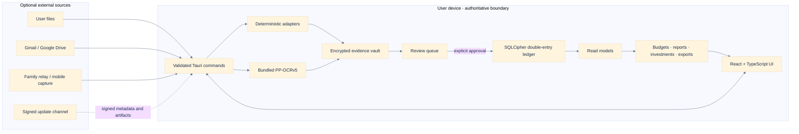
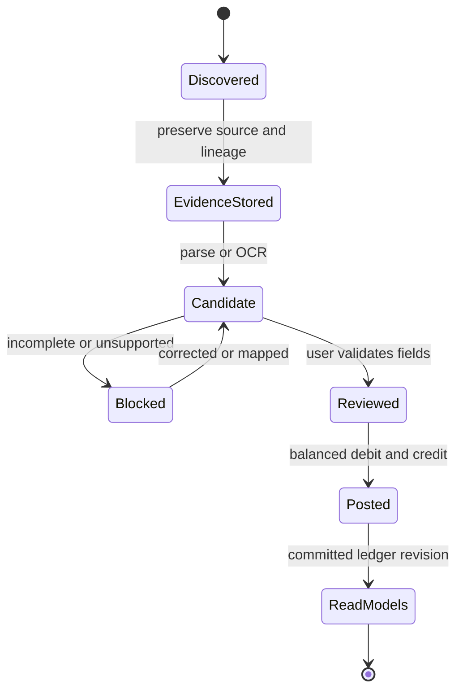

# KakeFlow architecture / Kiến trúc / アーキテクチャ

## Runtime and trust boundaries

External services are optional ingress or distribution boundaries. The local SQLCipher ledger is authoritative. OCR and parsing produce candidates and immutable source evidence; they do not create confirmed accounting entries without explicit review.

## Posting invariant

The `Candidate → Posted` transition is allowed only after validation and balanced-entry checks. Duplicate detection, audience attribution and source lineage are preserved across that transition.

## Code ownership

| Layer | Canonical location | Responsibility |
| --- | --- | --- |
| Application UI | `src/` | Workspaces, localization, browser demo data and validated platform DTOs. |
| Native boundary | `src-tauri/src/lib.rs` | Tauri command registration and state ownership. |
| Domain and persistence | `src-tauri/src/` | SQLCipher persistence, evidence vault, imports, accounting, reports, investments and optional connectors. |
| Schema evolution | `src-tauri/migrations/` | Forward-only data migrations and compatibility projections. |
| Relay reference service | `relay-service/` | Optional encrypted family-delivery and capture transport; never the ledger of record. |
| Product website | `docs/` | GitHub Pages landing page, localized demo media and maintained documentation. |

## Compatibility policy

Compatibility readers and migrations are retained when they protect existing backups, evidence bundles, dashboard preferences or family-delivery data. They are not dead code. A compatibility path may be removed only after its supported input version is formally retired, fixtures are removed, and restore/migration tests are updated in the same change.

## Tiếng Việt

Frontend React/TypeScript chạy trong Tauri 2 và chỉ giao tiếp với Rust qua command đã kiểm tra DTO. Rust quản lý SQLCipher, evidence vault, parser, OCR, ranh giới kế toán và read model. Dữ liệu từ file hoặc connector chỉ trở thành candidate; người dùng phải duyệt và bút toán phải cân bằng trước khi vào sổ cái. Relay và connector là biên tùy chọn, không phải nguồn dữ liệu authoritative.

Code compatibility cho backup, evidence, preference và dữ liệu chia sẻ phiên bản cũ vẫn được giữ khi cần bảo vệ khả năng restore/migrate; không coi các path này là code thừa nếu test compatibility còn yêu cầu.

## 日本語

React／TypeScript frontend は Tauri 2 上で動作し、検証済み DTO の command を通じて Rust と通信します。Rust が SQLCipher、証拠 vault、parser、OCR、会計境界、read model を所有します。ファイルや connector から得たデータは candidate に留まり、人による確認と貸借一致を通過した場合だけ台帳へ反映されます。relay／connector は任意の境界であり、authoritative ledger ではありません。

旧 backup、evidence、preference、family delivery を復元・移行する compatibility path は、対応データを保護するために必要な限り保持します。compatibility test が要求する処理は未使用 code として削除しません。
