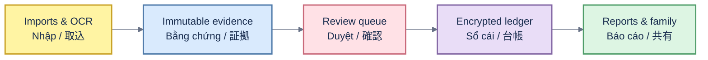

# KakeFlow architecture / Kiến trúc / アーキテクチャ

## English

The React/TypeScript frontend runs inside Tauri 2. Rust commands own local encrypted persistence, import parsing, evidence lineage and accounting boundaries. Extracted candidates enter a review queue; only confirmed records reach the double-entry ledger. Connectors and OCR fail closed on incomplete semantics.

## Tiếng Việt

Frontend React/TypeScript chạy trong Tauri 2. Rust command quản lý lưu trữ mã hóa local, parser import, evidence lineage và ranh giới kế toán. Candidate trích xuất vào hàng đợi duyệt; chỉ record đã xác nhận mới vào sổ kép. Connector/OCR fail-closed khi semantics chưa đủ.

## 日本語

React/TypeScript frontend は Tauri 2 内で動作します。Rust command がローカル暗号化保存、取込解析、証拠来歴、会計境界を担当します。抽出候補は確認キューに入り、承認済み記録だけが複式簿記台帳へ反映されます。意味が不完全な connector／OCR は fail-closed です。
