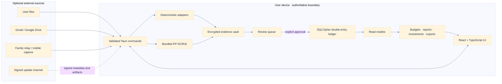
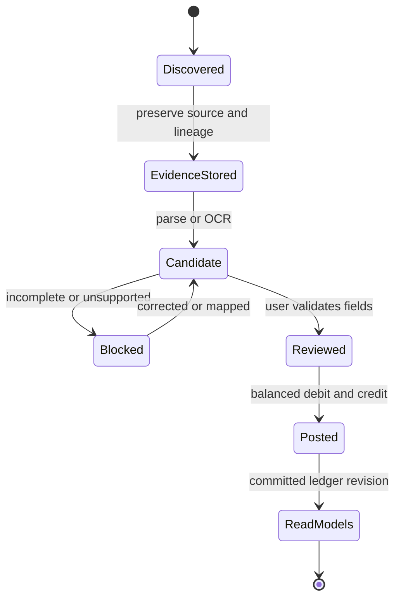

# KakeFlow architecture / Kiến trúc / アーキテクチャ

## Runtime and trust boundaries

External services are optional ingress or distribution boundaries. The local SQLCipher ledger is authoritative. OCR and parsing produce candidates and immutable source evidence; they do not create confirmed accounting entries without explicit review.

## Connector control plane

The connector registry defines four import-source kinds: manual import, watched folder, Google Drive, and Gmail. The Control Center reads redacted public summaries and binding projections; it does not own provider authorization, credentials, folder or label selection, cursor advancement, or source-specific scheduling. Configure, refresh, retry, and disconnect actions delegate to the existing source adapter and its authoritative lease/worker.

Source-account bindings fail closed. A candidate whose source account, parser profile, or parser version no longer matches the durable binding remains reviewable but cannot be committed until the user explicitly remaps and approves it. `Refresh all` snapshots at most 10,000 configured sources, orders them by connector kind and connection key, and persists each redacted result before continuing. Retryable failure is isolated to one item; an expired batch lease can be recovered without advancing a source cursor or replaying an already committed result.

The PWA exposes only its local manual-import summary and configuration route. Native provider adapters and their credential state are not bundled into the PWA. This is a control plane over import sources, not direct institution aggregation or a claim of Money Forward or Rakuten parity.

## Browser runtime

KakeFlow now has three explicit runtimes. Tauri uses SQLCipher and the native encrypted evidence vault; the PWA uses encrypted event envelopes and projections in IndexedDB plus encrypted evidence in OPFS, falling back to IndexedDB when OPFS is unavailable; demo mode remains immutable synthetic data. Production PWA builds cannot fall back to demo mode.

`crates/kakeflow-core` is the platform-neutral Rust boundary for posting approval, debit/credit balance, money validation, provenance identity, and canonical posting hashes. Tauri links the crate natively and the PWA invokes the committed WASM build before writing browser events. The persistence formats differ: a PWA encrypted archive is not a SQLCipher desktop backup.

The browser ledger is authoritative for the supported PWA workflow. Candidate approval, posting entries, provenance edges, and the projection revision commit in one IndexedDB transaction. Encrypted archive restore validates the manifest, exact file set, hashes, lengths, schemas, and every authenticated envelope in a staging vault before switching the active-vault pointer.

## Posting invariant

The `Candidate → Posted` transition is allowed only after validation and balanced-entry checks. Duplicate detection, audience attribution and source lineage are preserved across that transition.

## Code ownership

| Layer | Canonical location | Responsibility |
| --- | --- | --- |
| Application UI | `src/` | Workspaces, localization, browser demo data and validated platform DTOs. |
| Native boundary | `src-tauri/src/lib.rs` | Tauri command registration and state ownership. |
| Domain and persistence | `src-tauri/src/` | SQLCipher persistence, evidence vault, imports, accounting, reports, investments and optional connectors. |
| Schema evolution | `src-tauri/migrations/` | Forward-only data migrations and compatibility projections. |
| Relay reference service | `relay-service/` | Optional encrypted family-delivery and capture transport; never the ledger of record. |
| Product website | `docs/` | GitHub Pages landing page, localized demo media and maintained documentation. |
| Shared accounting core | `crates/kakeflow-core/` | Platform-neutral validation and canonical posting hashes for native Rust and WASM. |
| PWA runtime | `src/platform/pwa/`, `src/pwa/` | Encrypted browser vault, event ledger, evidence storage, offline UI and recovery. |

## Compatibility policy

Compatibility readers and migrations are retained when they protect existing backups, evidence bundles, dashboard preferences or family-delivery data. They are not dead code. A compatibility path may be removed only after its supported input version is formally retired, fixtures are removed, and restore/migration tests are updated in the same change.

## Tiếng Việt

Frontend React/TypeScript chạy trong Tauri 2 và chỉ giao tiếp với Rust qua command đã kiểm tra DTO. Rust quản lý SQLCipher, evidence vault, parser, OCR, ranh giới kế toán và read model. Dữ liệu từ file hoặc connector chỉ trở thành candidate; người dùng phải duyệt và bút toán phải cân bằng trước khi vào sổ cái. Relay và connector là biên tùy chọn, không phải nguồn dữ liệu authoritative.

Control Center chỉ hiển thị summary và binding đã redaction; thao tác configure/refresh/retry/disconnect được chuyển cho adapter và lease/worker của từng source. Binding sai sẽ fail closed cho đến khi người dùng remap và approve rõ ràng. PWA chỉ có manual import cục bộ, không đóng gói provider adapter hay credential native.

Runtime PWA dùng cùng `kakeflow-core` qua WASM để kiểm tra approval, cân bằng debit/credit, provenance và canonical hash trước khi commit. Event/projection mã hóa nằm trong IndexedDB; evidence mã hóa nằm trong OPFS hoặc IndexedDB fallback. Posting và projection revision được commit nguyên tử. Restore kiểm tra toàn bộ archive trong staging vault rồi mới đổi active pointer. Archive PWA không tương thích với backup SQLCipher native trong phase này.

Code compatibility cho backup, evidence, preference và dữ liệu chia sẻ phiên bản cũ vẫn được giữ khi cần bảo vệ khả năng restore/migrate; không coi các path này là code thừa nếu test compatibility còn yêu cầu.

## 日本語

React／TypeScript frontend は Tauri 2 上で動作し、検証済み DTO の command を通じて Rust と通信します。Rust が SQLCipher、証拠 vault、parser、OCR、会計境界、read model を所有します。ファイルや connector から得たデータは candidate に留まり、人による確認と貸借一致を通過した場合だけ台帳へ反映されます。relay／connector は任意の境界であり、authoritative ledger ではありません。

Control Center が表示するのは redaction 済み summary と binding だけで、configure／refresh／retry／disconnect は source ごとの adapter と lease／worker へ委譲します。binding 不一致は明示的な remap と approve まで fail closed です。PWA は local manual import だけを提供し、native provider adapter や credential を同梱しません。

PWA runtime は同じ `kakeflow-core` を WASM として使用し、approval、debit／credit 一致、provenance、canonical hash を commit 前に検証します。暗号化 event／projection は IndexedDB、暗号化 evidence は OPFS または IndexedDB fallback に保存されます。posting と projection revision は原子的に commit され、restore は staging vault 全体を検証してから active pointer を切り替えます。この phase の PWA archive は native SQLCipher backup と互換ではありません。

旧 backup、evidence、preference、family delivery を復元・移行する compatibility path は、対応データを保護するために必要な限り保持します。compatibility test が要求する処理は未使用 code として削除しません。
