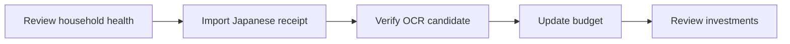

# Demo use case: one receipt to the whole financial picture

## Persona and boundary

The Tanaka family is a synthetic four-person, dual-income household in Japan. The demo uses JPY and covers salaries, bank accounts, cards, daily spending, budgets, and investments. Every name, amount, account suffix, document, and transaction is fictional.

KakeFlow runs the workflow locally. OCR results remain review candidates until the user confirms them; the application does not initiate payments.

## Scenario

After a household purchase, a family member wants to record the receipt, understand its effect on the monthly budget, and check whether the household remains aligned with its savings and investment plan.

## Demo flow

1. Review household health on the overview: current income, spending, budget status, and pending review work.
2. Import a Japanese receipt. Run on-device OCR and compare the extracted date, total, tax, and items with the source image.
3. Approve the candidate. Only the reviewed entry reaches the ledger; budget use and savings progress can then be reassessed.
4. Review the investment snapshot alongside household cash flow: portfolio value, unrealized gains, holdings, and allocation.

## Expected outcome

The presenter can explain daily spending, monthly planning, and long-term assets from one verified local ledger, while tracing imported values back to their source evidence.

## Published assets

The landing-page animation is generated in Japanese, English, and Vietnamese by `npm run landing:demo`:

- `docs/assets/demo/kakeflow-feature-tour-ja.gif`
- `docs/assets/demo/kakeflow-feature-tour-en.gif`
- `docs/assets/demo/kakeflow-feature-tour-vi.gif`

The generator uses localized product screenshots and localized narrative overlays. Do not replace these assets with personal financial data.

The three GIFs are 960 × 540, contain four frames, and are generated from the same story definition in `scripts/build-landing-demo.mjs`. `src/projectPage.test.ts` verifies their presence, dimensions, frame count and locale switching.

The account-free PWA evidence is `docs/assets/demo/kakeflow-receipt-to-provenance.mp4`, generated by `npm run capture:pwa:demo`. The reviewed H.264/yuv420p artifact is 1440 × 900 and 85.320 seconds. It shows real local PP-OCRv5, source comparison, explicit approval, balanced posting, provenance, offline reload, encrypted export, and atomic restore using only the repository's synthetic receipt. Verify it with the adjacent `.sha256` file; the exact sequence and claim boundaries are in [`demo/KakeFlow-90-second-storyboard.md`](demo/KakeFlow-90-second-storyboard.md).

## Tiếng Việt

Use case dùng dữ liệu tổng hợp của gia đình Tanaka bốn người. Flow demo đi từ tổng quan tài chính, nhập và duyệt OCR biên lai Nhật, cập nhật ngân sách đến kiểm tra đầu tư. Tất cả tên, giao dịch, số tiền và hậu tố tài khoản đều là hư cấu; không dùng dữ liệu cá nhân hoặc lịch sử mua sắm thật.

Video PWA 85.320 giây dùng một biên lai tổng hợp có sẵn trong repo, không cần account, và thể hiện PP-OCRv5 thật, đối chiếu nguồn, approval rõ ràng, bút toán cân bằng, provenance, reload offline, export mã hóa và restore nguyên tử. File `.sha256` bên cạnh xác định đúng artifact đã review.

## 日本語

この use case は、4 人世帯の田中家を表す合成データだけを使用します。家計全体の確認、日本語レシート OCR の取込・確認、予算更新、投資確認までを一つの flow として示します。氏名、取引、金額、口座末尾はすべて架空で、個人データや実際の購買履歴は含みません。

85.320 秒の PWA video は repository 内の合成 receipt のみを使い、account 不要で実際の PP-OCRv5、原本比較、明示的 approval、貸借一致、provenance、offline reload、暗号化 export、原子的 restore を示します。隣接する `.sha256` が review 済み artifact を識別します。
