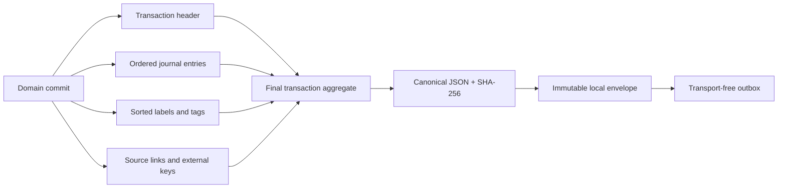

# Replicable ledger capture

KakeFlow 0.36 captures one canonical transaction as a complete, deterministic
ledger aggregate. This closes the v0.35 gap where a transaction header could be
recorded without the journal lines needed to reproduce balances.

## Aggregate contract

Every `TRANSACTION` upsert contains:

- the complete transaction header, including calculation, attribution, audience,
  and creation/update timestamps;
- journal entries ordered by line number and ID;
- labels and tags sorted by value;
- source-record/candidate references ordered by source-record ID;
- provider external keys ordered by source and external ID.

Household, household-member, and account payloads also include their full
canonical scalar fields. Account deletion and transaction deletion produce
explicit delete captures while normal member lifecycle remains archival.

## Coalescing and ordering

A posted transaction is normally created through several SQL writes. Each write
is captured in the same SQLite commit, but the drain emits only the latest
pending state for the transaction. Earlier intermediate captures are linked to
that same canonical envelope. This prevents a future receiver from observing a
header-only or one-sided journal state.

The outbox keeps monotonic per-device envelope sequences. Repeating a drain
without new domain writes is idempotent.

## Data-quality gates

Schema 33 restore validation checks the final replay candidate for each pending
transaction and every processed capture. A posted aggregate must have:

- at least two journal lines;
- positive integer JPY amounts and unique positive line numbers;
- only `DEBIT` or `CREDIT` sides;
- accounts belonging to the same household;
- equal debit and credit totals;
- typed label, tag, source-link, and external-key arrays;
- an exact operation and canonical-payload match for processed captures.

Automated tests create a posted transaction with two balanced journal entries,
metadata, a source reference, and a Money Forward external identity. They drain
the source database to one envelope, reconstruct the aggregate in a second
SQLite database, and verify the restored journal remains balanced and the
metadata/reference sets are unchanged.

## Boundary of this release

Source links are logical references. Source documents, source rows, candidates,
encrypted source bytes, import runs, portfolio observations, planning data, and
device-local watched-folder paths are not transported by 0.36. Card statements,
statement-to-purchase rows, confirmed card-payment links, and receipt-candidate
links remain in their source/reconciliation graphs and are also deferred until
those parent aggregates have a defined dependency order.

KakeFlow 0.36 still has no incoming-envelope runtime, remote transport, conflict
resolution, login, or cloud synchronization. The two-database replay is an
automated contract proof, not a user-facing multi-device sync claim.
