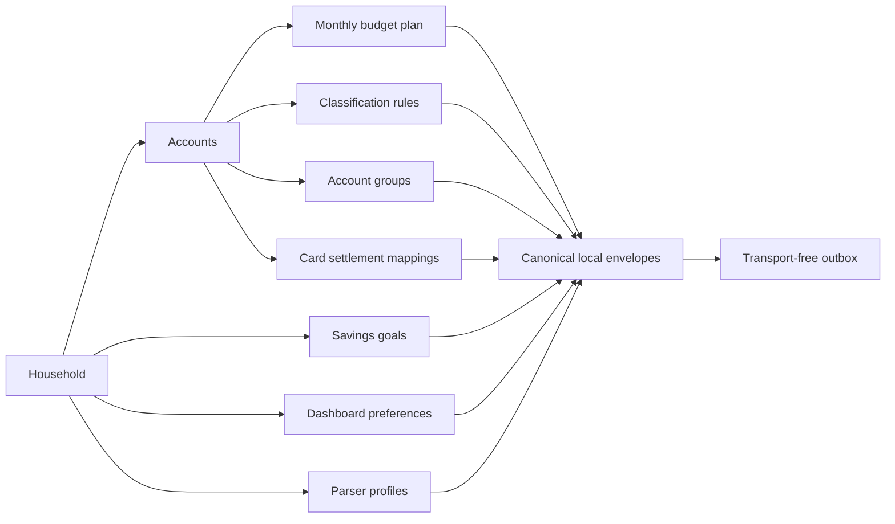

# Replicable planning and configuration capture

KakeFlow 0.37 extends the local change-envelope contract to the household plans
and reusable settings that shape day-to-day work. It captures seven portable,
user-authored aggregates without connecting to a server or applying an envelope
to another installation.

## Captured aggregates

- `MONTHLY_BUDGET_PLAN` is one household aggregate containing every monthly
  category budget ordered by month and category account. Treating the plan as
  one aggregate makes a row removal observable without inventing a compound
  external identity.
- `SAVINGS_GOAL` retains its name, target and saved amounts, target date,
  lifecycle status, and timestamps.
- `CLASSIFICATION_RULE` retains the complete rule plus labels and tags sorted by
  value. Child-table edits recapture the parent rule rather than becoming
  independent records.
- `ACCOUNT_GROUP` retains its kind, display order, timestamps, and account
  members ordered by member position and account ID.
- `CARD_SETTLEMENT_MAPPING` retains the explicit credit-card-to-bank account
  relationship. It does not include a statement, due date, or payment link.
- `DASHBOARD_PREFERENCES` retains the saved dashboard template, theme, and
  density. The deterministic unsaved default remains a local application
  default and produces no record until the user saves preferences.
- `DELIMITED_PARSER_PROFILE` retains the complete CSV/TSV mapping, parsing
  choices, enabled state, priority, and optimistic-concurrency version.

Every aggregate is household-scoped. Stable IDs cannot move between households,
and updates or child replacements created in one SQLite transaction are
coalesced to the latest pending state before an immutable envelope is created.
Deletes create tombstones for independently identified records; changing the
budget rows produces a new complete household budget-plan state.

## Dependency and replay proof

Schema 34 seeds existing planning and configuration state only after the schema
33 household and account dependencies. Validation checks canonical processed
payloads, typed scalar and array fields, allowed enum values, household scope,
and referenced account relationships before a restored database is activated.

Automated two-database tests reconstruct the seven aggregates in dependency
order and verify that amounts, statuses, sorted child sets, membership order,
account mappings, appearance choices, and parser-profile version are unchanged.
This is a reproducibility proof for the payload contract. It is not an
incoming-envelope runtime or a user-facing restore-from-envelope feature.

Classification-rule application history is not a configuration aggregate. The
resulting posted transaction category, journal, labels, and tags remain covered
by the separate [replicable ledger contract](REPLICABLE_LEDGER_CAPTURE.md).

## Boundary of this release

KakeFlow 0.37 does not capture or transport source documents, source rows,
encrypted source bytes, import runs, candidates, watched-folder state,
investment or portfolio observations, card statements, statement purchases,
confirmed card-payment links, receipt links, or derived analytics. Card due
dates remain part of the deferred statement aggregate rather than a detached
preference.

There is still no sync server, network transport, incoming apply runtime,
conflict or merge handling, login, remote principal authentication, backend
audience enforcement, cloud synchronization, or mobile receipt capture. The
outbox remains a device-local, inspectable record only.
