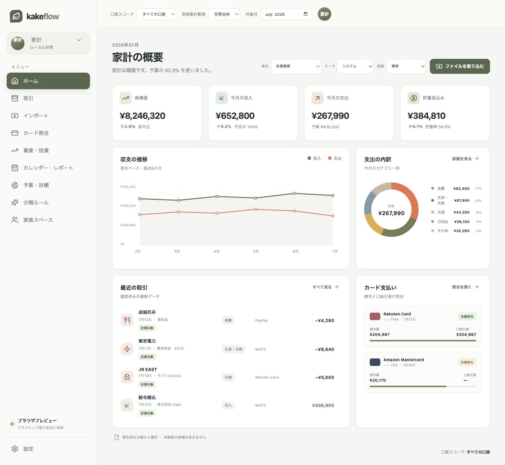
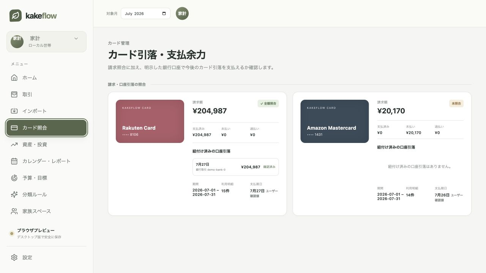
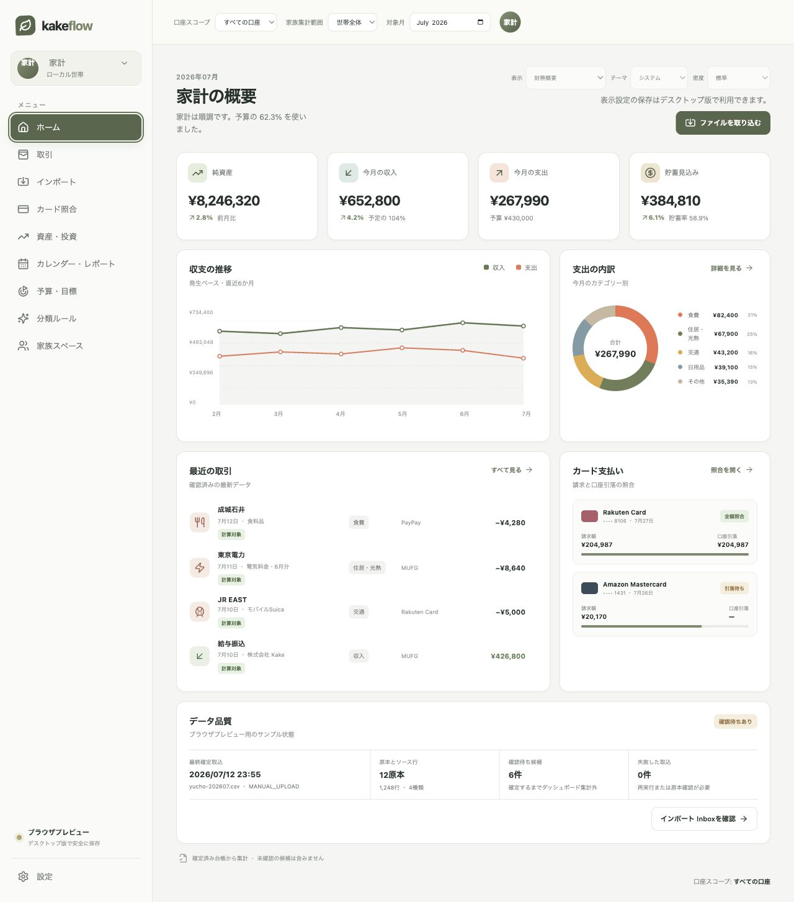

# KakeFlow dashboard and card-flow audit

Audit date: 2026-07-13  
Surface: browser preview at 1280 × 720  
Goal: understand household status, then inspect credit-card settlement health  
Mode: combined UX and screenshot-visible accessibility audit

## Step 1 — Household overview

Health: **Good, with data-trust and accessibility gaps**

Strengths:

- The page moves from outcome KPIs to trend, category drivers, transaction evidence, and card status in a clear summary-to-detail order.
- Income, expense, savings, and net-worth values are visually distinct without turning the screen into a wall of charts.
- Accounting basis and confirmed-ledger caveats are present.

Risks and opportunities:

- The only data-quality disclosure is a very small footer. The screen does not expose source freshness, last successful import, pending review, or accounts with incomplete coverage near the metrics they qualify.
- KPI arrows and percentages do not say “increase” or “decrease” in accessible text, so direction relies on icon shape.
- Trend-axis labels, chart legend, transaction metadata, and the footer are visually small and low contrast at the captured desktop size.
- The browser preview exposes template, theme, and density controls even though persistence is a desktop capability; the attempted template change did not change the preview. An enabled control that does nothing weakens trust.
- The trend chart has an image label but no adjacent numeric summary or bounded table for people who cannot read the plotted lines.

## Step 2 — Card settlement

Health: **Clear accounting status, but provenance is under-explained**

Strengths:

- Statement amount, paid, outstanding, and overpaid values remain separate, preventing the bank settlement from looking like a second expense.
- Confirmed payment evidence appears beside the statement and the status is not communicated by color alone.
- The due date is explicitly labeled as a user-confirmed value.

Risks and opportunities:

- The screen does not show when each statement source was imported or whether newer source data is waiting for review.
- The browser preview cannot demonstrate the new due-date correction action, but it does not explain that the action is desktop-only.
- The large card artwork receives similar visual weight to the statement controls and evidence; on information-dense screens the evidence should dominate.
- Small secondary text and compact targets need keyboard, focus, zoom, and contrast verification in the packaged app; screenshots alone cannot establish WCAG compliance.

## Highest-impact recommendations

1. Add one source-backed dashboard data-quality summary with latest confirmed import, pending review count, failed import count, and explicit account/source coverage gaps.
2. Make the summary drill into Import Inbox rather than adding more passive dashboard decoration.
3. Add semantic direction text to KPI deltas and an accessible numeric summary for the six-month trend.
4. Make unsupported browser-preview preferences visibly read-only or apply them locally; never leave enabled no-op controls.
5. Keep provenance and freshness definitions in the same native read model used by the dashboard so cards and footer cannot disagree.

## Evidence limits

This audit used the current browser preview and two accepted screenshots. It did not test the packaged WebView's OS focus ring, screen-reader announcements, 200% zoom, native date input, actual user financial data, or desktop-only database mutation. Those require packaged-app interaction and assistive-technology checks rather than screenshot inference.

## Implemented response

- Added a source-backed data-quality region with latest confirmed import, source and row counts, pending candidates, failed imports, and a direct Import Inbox action.
- Added accessible increase/decrease labels to KPI deltas and a screen-reader table containing the same six-month values as the trend chart.
- Made unsupported browser-preview display preferences read-only and explained that persistence is available in the desktop app.
- Reflowed the display controls and desktop note so the header remains readable at the audited 1280-pixel viewport.
