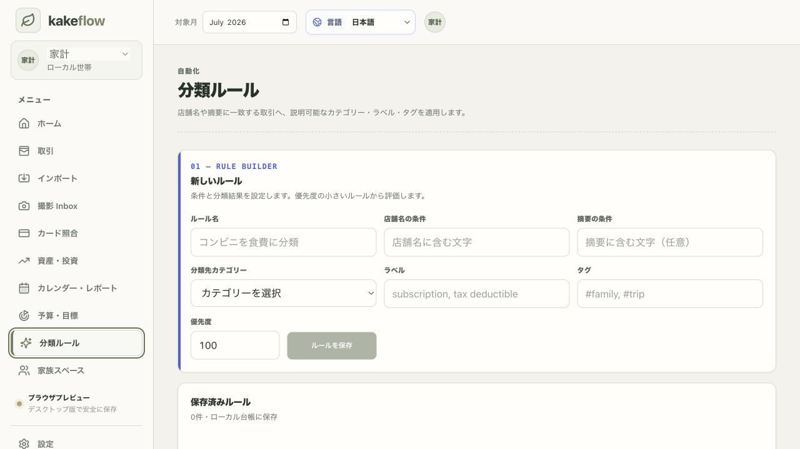
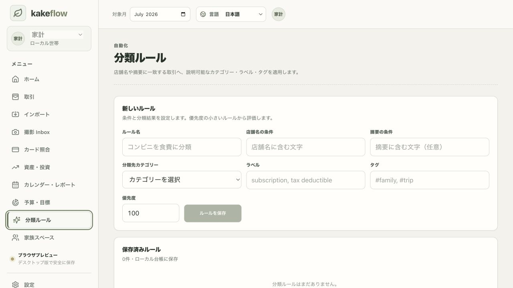

# Classification Rules visual rollback audit — 2026-07-16

Scope: desktop browser preview at 1280 × 720, Japanese locale, Classification Rules screen.

## 1. Before — editorial cobalt mix

Finding: the cobalt edge, English monospace kicker, and blue-outlined language control introduced a second visual language that competed with KakeFlow's quiet paper-and-olive system. The form structure was improved, but the accents felt detached from the rest of the product.

## 2. After — warm paper and olive

Result: removed the cobalt/orange tokens, English kicker, colored edge, blue focus treatment, and alternating orange chips. Kept the labeled field groups, responsive grid, clear hierarchy, and visible language selector. Focus and action states now use the existing olive tokens.

## Runtime checks

- Classification Rules navigation opened successfully.
- Japanese labels and accessible control names remained present.
- Browser console returned no errors.
- Screenshot review found no clipping, overflow, or alignment regression at the audited viewport.

Screenshot evidence cannot validate keyboard focus order, screen-reader announcements, or every responsive breakpoint; those remain covered by code review and automated tests where available.

final result: passed
