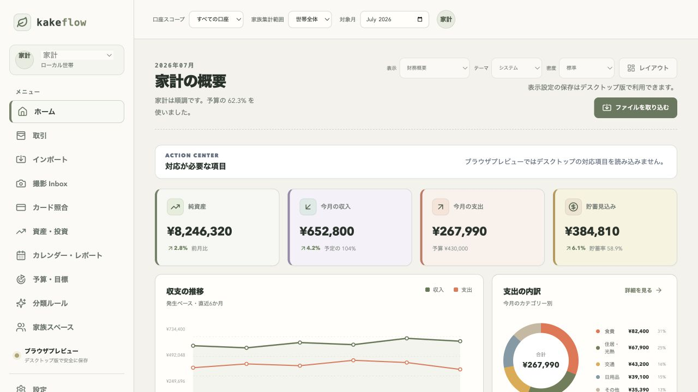
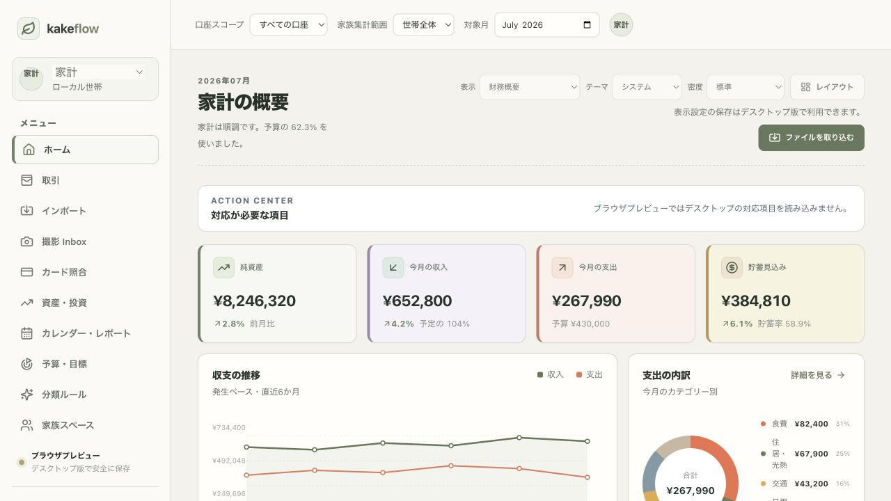
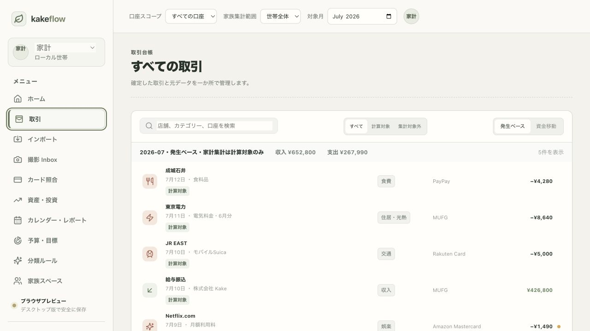
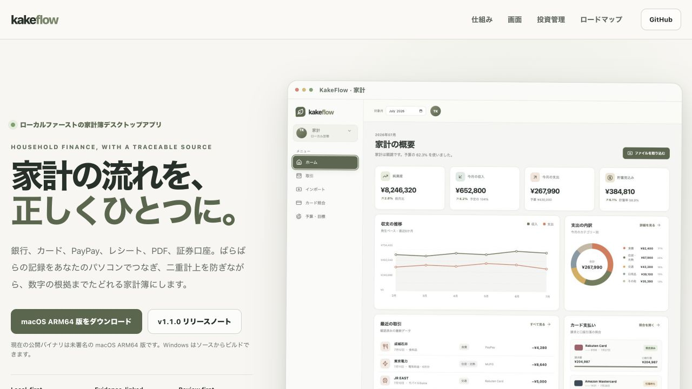

# Kiểm tra typography KakeFlow — 2026-07-15

## Phạm vi

- Ứng dụng desktop/browser preview: Home và Transactions.
- Trang giới thiệu tại `docs/index.html`.
- Infographic SVG trong `docs/assets/infographics`.
- PDF và workbook xuất từ native core.

Mục tiêu là tăng khả năng đọc trên macOS/Windows, giữ tiếng Nhật ổn định, và
không làm mất mật độ thông tin cần thiết của một ứng dụng tài chính.

## Kết luận

Typography sau thay đổi rõ ràng và nhất quán hơn. `Avenir Next` không còn là
font chính; giao diện dùng một system stack phổ biến với fallback tiếng Nhật.
Các khai báo 7–9px đã được loại bỏ, còn 10px chỉ dùng cho nhãn biểu đồ hoặc
metadata rất ngắn. Các nội dung thường xuyên phải đọc dùng 11–12px trở lên.

## Các bước đã kiểm tra

1. **Home trước thay đổi — cần cải thiện.** Nội dung chính rõ, nhưng metadata,
   nhãn biểu đồ và một số caption quá nhỏ; brand/caption monospace tạo cảm giác
   kỹ thuật hơn mức cần thiết.

   

2. **Home sau thay đổi — tốt.** Font system hiển thị tiếng Nhật tự nhiên hơn,
   KPI dùng số tabular dễ so sánh, caption lớn hơn và hierarchy vẫn giữ nguyên.

   

3. **Transactions sau thay đổi — tốt.** Tên merchant, metadata, category,
   account và amount vẫn phân cấp rõ; kích thước chữ tăng nhưng bảng không bị
   tràn ngang ở viewport kiểm tra.

   

4. **Trang dự án sau thay đổi — tốt.** Headline, nội dung Nhật ngữ, navigation
   và CTA dùng cùng font stack với app; các chú thích nhỏ dễ đọc hơn.

   

## Quy chuẩn đã áp dụng

- UI: `Inter` → font hệ điều hành → `Noto Sans JP` → font Nhật bản địa.
- Kỹ thuật: SF Mono/Consolas/Liberation Mono/Menlo.
- Số tài chính: `tabular-nums` và `lining-nums`.
- Controls kế thừa typography từ ứng dụng, gồm button/input/select/textarea.
- Infographic dùng cùng fallback stack, không phụ thuộc riêng vào Inter.
- PDF tiếp tục nhúng Noto Sans JP để kết quả xuất không phụ thuộc font cài trên
  máy. Workbook giữ font Office mặc định để tương thích Excel đa nền tảng.

## Rủi ro và giới hạn kiểm tra

- Screenshot không chứng minh đầy đủ WCAG, zoom 200%, screen reader hoặc mọi
  cấu hình font của hệ điều hành.
- Cần kiểm tra thêm trên Windows thật để xác nhận Segoe UI/Yu Gothic UI và ở
  macOS packaged app để xác nhận SF/Hiragino sau khi đóng gói.
- Các màn hình rất dày dữ liệu vẫn giữ một số nhãn 10px; đây là nhãn phụ, không
  phải nội dung hoặc hành động chính.

## Khuyến nghị duy trì

1. Không thêm font web tải từ CDN vào desktop app.
2. Không dùng monospace cho brand, navigation hay nội dung giải thích.
3. Mọi màn hình mới nên dùng tối thiểu 12px cho nội dung và 10px chỉ cho nhãn
   phụ ngắn.
4. Kiểm tra lại reflow khi thêm bản dịch tiếng Anh và tiếng Việt vì chuỗi có thể
   dài hơn tiếng Nhật.
